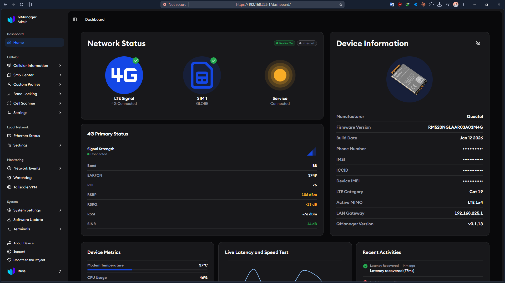

# QManager — Universal Go Edition 🚀

<div align="center">
  
  <h3>Universal, High-Performance Go-Powered GUI & Core for Cellular Modem Management</h3>
  <p>Visualize, configure, and optimize Quectel & Universal cellular modems with an ultra-lightweight Go backend and React 19 UI</p>

  
  
  
  
  
  
  
</div>

---

<div align="center">
  
</div>

---

## ⚡ Installation Guide

Choose between the **1-Click Automatic Deployment** (recommended) or **Manual Installation**.

---

### 1. 🚀 Automatic 1-Click Installation (Recommended)

#### Option A: Direct 1-Line Remote Install (On Modem / Router)
Run this single command over SSH on your target modem/router (e.g. `192.168.225.1`):

```sh
wget -qO- https://raw.githubusercontent.com/latifangren/QManager-GO/main/deploy.sh | sh
```

#### Option B: Deploy from Workstation via SSH / ADB

**From Bash / Linux / macOS:**
```sh
# Deploy over SSH to default modem IP (192.168.225.1)
./deploy.sh

# Or deploy to custom IP
./deploy.sh 192.168.1.1

# Or deploy over ADB connection
./deploy.sh adb
```

**From Windows PowerShell:**
```powershell
# Deploy over SSH
.\deploy.ps1 -Target "192.168.225.1"

# Or deploy over ADB
.\deploy.ps1 -Method "ADB"
```

---

### 2. 🛠️ Manual Installation Guide

If you are uploading compiled binaries directly to modems (Quectel RM520N/RM551E), Raspberry Pi, or x86 Linux hosts:

#### Step 1: Select & Upload the Binary for Your Architecture
Compiled binaries live in `backend/dist/`:
- **Quectel RM520N / RM500Q / SDX55 / SDX62 / SDX65 (ARM 32-bit)**: `qmanager-core-armv7`
- **Quectel RM551E / Raspberry Pi 4/5 / Router (ARM 64-bit)**: `qmanager-core-arm64`
- **PC / X86_64 Router / Linux VM**: `qmanager-core-amd64`

Upload via SCP to `/usrdata/qmanager-core` (or `/usr/bin/qmanager-core`):
```sh
scp backend/dist/qmanager-core-armv7 root@192.168.225.1:/usrdata/qmanager-core
ssh root@192.168.225.1 "chmod +x /usrdata/qmanager-core"
```

#### Step 2: Systemd Autostart Configuration (`/lib/systemd/system/qmanager-core.service`)
Create or edit `/lib/systemd/system/qmanager-core.service` on the device:

```ini
[Unit]
Description=QManager Go Core Service
After=basic.target

[Service]
Type=simple
ExecStart=/usrdata/qmanager-core
Restart=always
RestartSec=2
KillMode=process
Environment=PORT=80
Environment=TLS_PORT=443
Environment=TLS_ENABLED=true

[Install]
WantedBy=multi-user.target
```

> ⚠️ **Important Systemd Boot Fix Note:**
> Do **NOT** set `After=network-online.target` on Qualcomm Quectel modems. On Quectel internal Linux OS, `network-online.target` remains inactive during cold boot, which prevents Systemd from auto-starting services after a power cycle. Using `After=basic.target` guarantees instant autostart upon boot.

#### Step 3: Enable & Start Systemd Service
```sh
ssh root@192.168.225.1 "systemctl daemon-reload && systemctl enable qmanager-core && systemctl start qmanager-core"
```

#### Step 4: OpenWRT Procd / Init.d Setup (Non-Systemd Devices)
If your device runs OpenWRT without systemd:

```sh
# Create /etc/init.d/qmanager-core
cat << 'EOF' > /etc/init.d/qmanager-core
#!/bin/sh /etc/rc.common
START=99
STOP=10

start() {
    killall -9 qmanager-core 2>/dev/null
    /usrdata/qmanager-core >/dev/null 2>&1 &
}

stop() {
    killall -9 qmanager-core 2>/dev/null
}
EOF

chmod +x /etc/init.d/qmanager-core
ln -sf /etc/init.d/qmanager-core /etc/rc.d/S99qmanager-core
/etc/init.d/qmanager-core start
```

---

## 🔄 Removing Legacy QManager / SimpleAdmin / QuecManager (Full Migration to QManager-Go)

If your modem previously ran **legacy QManager (PHP/Python/Lighttpd)**, **SimpleAdmin**, or **QuecManager**, this guide removes ALL of it so your modem runs **exclusively** on QManager-Go.

### 1. What Happens to Legacy Software?
- **Port Conflict (80/443)**: `qmanager-core` is a standalone Go binary with an embedded Next.js SPA frontend and native HTTP server on Port 80/443. Anything else bound to those ports (lighttpd, SimpleAdmin, python) must be removed.
- **Data & Config Preserved**: `qmanager-core` reads/writes the exact same `/etc/qmanager/` config directory (APN, band locks, SIM profiles, DNS, tower locks). Migration will **NOT** delete saved SIM profiles or settings.
- **Security**: Legacy SimpleAdmin ships dangerous leftovers — a world-writable `.htpasswd`, `www-data` sudoers granting `cat`/`echo` as root (read `/etc/shadow`), and AT-bridge socat daemons. All of these are removed below.

### 2. Stop & Disable All Legacy Services

```sh
ssh root@192.168.225.1

# Legacy web daemons (lighttpd / python / QuecManager)
systemctl stop lighttpd 2>/dev/null; systemctl disable lighttpd 2>/dev/null
/etc/init.d/lighttpd stop 2>/dev/null; /etc/init.d/lighttpd disable 2>/dev/null
killall -9 lighttpd python python3 2>/dev/null

# SimpleAdmin helper daemons (firewall, socat AT-bridge, TTL override, auto-update)
systemctl stop simplefirewall ttl-override install_simpleadmin 2>/dev/null
systemctl disable simplefirewall ttl-override install_simpleadmin 2>/dev/null

for u in socat-smd11 socat-smd11-from-ttyIN socat-smd11-to-ttyIN \
         socat-smd7 socat-smd7-from-ttyIN2 socat-smd7-to-ttyIN2 socat-killsmd7bridge; do
  systemctl stop $u 2>/dev/null; systemctl disable $u 2>/dev/null
done

# Purge stale systemd unit references (rootfs is read-only; disable is enough)
systemctl daemon-reload
```

### 3. Delete Legacy Directories & Dangerous Files

```sh
# SimpleAdmin + socat + firewall + auto-updater directories
rm -rf /usrdata/simplefirewall /usrdata/simpleupdates /usrdata/socat-at-bridge

# Old QManager web assets (kept as backup by past deploy scripts)
rm -rf /usrdata/qmanager/web.old

# World-writable password files & helper scripts (privilege-escalation risks)
rm -f /opt/etc/.htpasswd /usrdata/opt/etc/.htpasswd
rm -f /usrdata/cfun_fix.sh
rm -f /usrdata/root/bin/simplepasswd /usrdata/root/bin/htpasswd

# Broken cron referencing a removed watchcat script
sed -i '/watchcat.sh/d' /etc/crontab
```

> ⚠️ Unit files under `/lib/systemd/system/` can NOT be deleted (rootfs is read-only on Quectel modems) — but once disabled they never start again. Do not attempt to `rm -f` them.

### 4. Harden `www-data` Sudoers (Kill Privilege Escalation)

Legacy SimpleAdmin grants `www-data` passwordless `cat`/`echo` as root, which lets a compromised web user read `/etc/shadow` and write arbitrary files. QManager-Go runs as **root** and does not need those. Strip them from **both** sudoers copies:

```sh
for f in /opt/etc/sudoers.d/www-data /usrdata/opt/etc/sudoers.d/www-data; do
  [ -f "$f" ] && sed -i 's|, /bin/echo, /bin/cat||' "$f"
done
# Verify: should now print "sudo: a password is required"
sudo -u www-data sudo -n cat /etc/shadow
```

### 5. Install Persistent Firewall (Block Internet Access to Dashboard)

`qmanager-core` listens on `:80/:443/:8838` bound to ALL interfaces — including `rmnet_data0` (the SIM WAN link). Without a firewall the dashboard is reachable from the public internet. Add a persistent, idempotent firewall service:

```sh
cat > /usrdata/qmanager-firewall.sh <<'EOF'
#!/bin/sh
# QManager firewall: block internet (rmnet_data0) access to modem services, keep LAN.
iptables -C INPUT -i rmnet_data0 -p tcp --dport 80 -j DROP  2>/dev/null || iptables -A INPUT -i rmnet_data0 -p tcp --dport 80 -j DROP
iptables -C INPUT -i rmnet_data0 -p tcp --dport 443 -j DROP 2>/dev/null || iptables -A INPUT -i rmnet_data0 -p tcp --dport 443 -j DROP
iptables -C INPUT -i rmnet_data0 -p tcp --dport 8838 -j DROP 2>/dev/null || iptables -A INPUT -i rmnet_data0 -p tcp --dport 8838 -j DROP
iptables -C INPUT -i rmnet_data0 -p tcp --dport 22 -j DROP 2>/dev/null || iptables -A INPUT -i rmnet_data0 -p tcp --dport 22 -j DROP
exit 0
EOF
chmod +x /usrdata/qmanager-firewall.sh

cat > /etc/systemd/system/qmanager-firewall.service <<'EOF'
[Unit]
Description=QManager Firewall (block internet access to modem services)
After=network.target
Before=qmanager-core.service

[Service]
Type=oneshot
ExecStart=/usrdata/qmanager-firewall.sh
RemainAfterExit=yes

[Install]
WantedBy=multi-user.target
EOF

systemctl daemon-reload
systemctl enable --now qmanager-firewall
```

### 6. Enable & Start QManager Go Edition (Autostart on Boot)

```sh
systemctl daemon-reload
systemctl enable qmanager-core
systemctl restart qmanager-core

# Verify
systemctl is-enabled qmanager-core   # → enabled
systemctl is-active  qmanager-core   # → active
curl -sk -o /dev/null -w '%{http_code}\n' https://127.0.0.1/  # → 200
```

> ⚠️ **Quectel cold-boot quirk**: on RM500Q/RM520N the full boot takes ~80s (`network.target` + QCMAP bring-up). SSH usually comes up in 1–2 min; `qmanager-core` may start ~80s after power-on even when enabled. That is normal — do not mistake it for a failed autostart. If you need web up sooner, use `After=basic.target` in the unit instead of `After=network.target` (see Step 2 note above).

---

## 📱 Supported Modem Hardware & Platforms

`QManager Go Edition` is engineered to be 100% universal across all Quectel 4G/5G cellular modems and host environments:

| Hardware Platform | Qualcomm Chipset | Operating System | Binary Executable | Target Modem Devices |
| :--- | :--- | :--- | :--- | :--- |
| **ARMv7 32-bit (SDX55 / SDX62 / SDX65)** | SDX55, SDX62, SDX65 | Linux + Systemd | `qmanager-core-armv7` | **Quectel RM520N-GL**, RM500Q-GL, RM502Q-AE, **RG501Q-EU**, RM521F-GL |
| **ARMv8 64-bit / ARM64 (SDX72 / SDX75)** | SDX72, SDX75 | Native OpenWRT (`init.d`) | `qmanager-core-arm64` / `armv7` | **Quectel RM551E-GL**, RM550E-GL, RG650V-EU |
| **Host Router & Gateways (ARM64)** | Any (Passthrough) | OpenWRT / Linux | `qmanager-core-arm64` | Raspberry Pi 4/5, NanoPi, GL.iNet, FriendlyWrt |
| **PC & Router Hardware (x86_64)** | Any (Passthrough) | Linux / OpenWRT x86 | `qmanager-core-amd64` | x86 Routers, Mini PCs, MikroTik CHR, Linux VMs |

---

## 🛠️ Building QManager Go Edition

To build the complete single-executable binary (`qmanager-core`) containing the embedded Next.js frontend:

```sh
# Clone the repository
git clone https://github.com/latifangren/QManager-GO.git
cd QManager-GO

# Run the unified multi-architecture build script
./build-go.sh
```

**Compiled Executables (`backend/dist/`):**
* `qmanager-core-armv7` (Quectel RM520N / ARM 32-bit)
* `qmanager-core-arm64` (Raspberry Pi 4/5, Router ARM64)
* `qmanager-core-amd64` (PC / X86_64 Router / VM)
* `qmanager-core` (Default alias ARMv7)

---

## ⚙️ Environment Variables Reference

| Environment Variable | Default Value | Description |
| :--- | :--- | :--- |
| `PORT` | `80` | HTTP server listening port |
| `TLS_PORT` | `443` | HTTPS server listening port (Auto TLS) |
| `TLS_ENABLED` | `true` | Set to `false` to disable auto-generated TLS certificates |
| `WEB_ROOT` | *(Embedded)* | Optional filesystem path to static web assets if overriding `embed.FS` |
| `AT_DEVICE` | `/dev/smd11` | Custom AT serial device path |

---

## 🌐 Supported REST API Endpoints

QManager Go Edition maintains 100% route compatibility with legacy CGI endpoints:

| Endpoint Path | Description |
| :--- | :--- |
| `/cgi-bin/quecmanager/auth/login.sh` | Authenticate user & issue session cookie |
| `/cgi-bin/quecmanager/auth/check.sh` | Verify current session validity |
| `/cgi-bin/quecmanager/at_cmd/fetch_data.sh` | Retrieve live modem status JSON |
| `/cgi-bin/quecmanager/at_cmd/send_command.sh` | Safely execute raw AT commands |
| `/cgi-bin/quecmanager/cellular/radio_details.sh` | On-demand timing advance & DNS readout |
| `/cgi-bin/quecmanager/profiles/list.sh` | List saved SIM profiles |
| `/cgi-bin/quecmanager/bands/current.sh` | Query active LTE & 5G NR band locks |
| `/cgi-bin/quecmanager/bands/lock.sh` | Apply LTE/5G band lock configuration |
| `/cgi-bin/quecmanager/cellular/sms.sh` | Storage-aware SMS list, send, and delete |
| `/cgi-bin/quecmanager/tower/lock.sh` | 4G & 5G NR SA Cell/Tower Locking |
| `/cgi-bin/quecmanager/frequency/lock.sh` | EARFCN/ARFCN Channel Locking |
| `/cgi-bin/quecmanager/network/data_used.sh` | Real-time byte counters & throughput |
| `/cgi-bin/quecmanager/system/reboot.sh` | Execute system or modem reboot |
| `/cgi-bin/quecmanager/health` | Go backend health check & system architecture |

---

## 💙 License & Acknowledgments

This project is licensed under the **[MIT License with Commons Clause](LICENSE)**.

- Built upon the foundations of **[QManager Universal](https://github.com/dr-dolomite/QManager)** by [DrDolomite](https://github.com/dr-dolomite).
- Inspired by concepts from **[QuecTool](https://github.com/snowzach/quectool)**.
